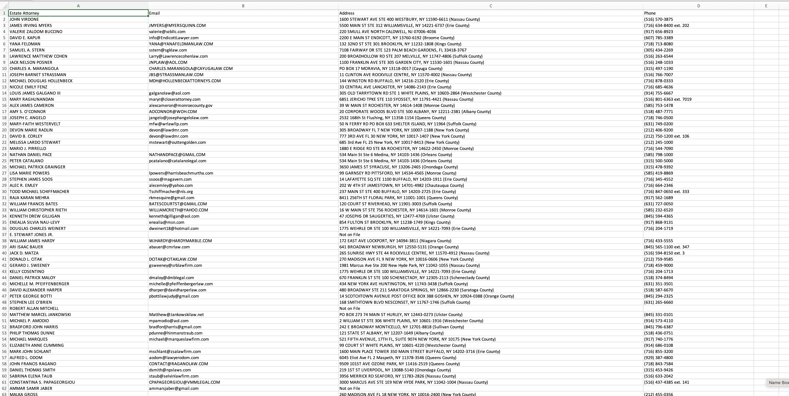

# New York Attorney Contact Detail Harvester

**Target Portal:** [New York Unified Court System - Attorney Search](https://iapps.courts.state.ny.us/attorneyservices)

A professional web automation tool built with **Python**, **Playwright**, and **BeautifulSoup4**. This script is designed to navigate high-security New York Court portals to find verified contact information for legal professionals.


## 🚀 How It Works

This script functions as the second phase of a data processing pipeline, taking attorney names from court filings and retrieving their full professional profiles:

1.  **Data Synchronization**: It reads names from an existing `scraped_data.csv` and removes duplicates.
2.  **Name Normalization**: It automatically cleans prefixes and suffixes from names to match the specific format required by the court's search form.
3.  **Intelligent Search**: It enters names into the portal and uses a matching algorithm to identify the correct attorney profile.
4.  **Automatic Tab Management**: The portal opens profiles in a **new browser tab**. The script detects this, automatically switches focus to the new tab, and extracts the data.
5.  **Profile Extraction**: The script captures the **Email, Address, and Phone Number**, saves it to a CSV, and closes the tab to maintain session stability.

---

## 🛠 High-Security Bypass Strategy (Cloudflare & hCaptcha)

New York Court data is protected by extremely aggressive security measures. This script is engineered to handle these specific challenges:

* **The Challenge**: The site uses **Cloudflare Turnstile** and **hCaptcha**. Because the Cloudflare Site Key is hidden (not found in the HTML), it is impossible to use standard services like 2Captcha to bypass it. 
* **The Protection**: Even after just 5 attorney searches, the site frequently triggers new hCaptcha challenges. These vary every time—ranging from "find the bicycles" and puzzles to "pick the matching image."
* **The Solution (Session Persistence)**: This script does not use a standalone bot. Instead, it connects to an **already running Chrome instance** via Chrome DevTools Protocol (CDP). 
    * By attaching to your real browser profile, the script inherits your "trusted" session.
    * **Manual Interaction**: Because of the variable nature of the hCaptcha, this script allows for human-in-the-loop interaction. When a captcha appears, you can solve it manually in the open Chrome window, and the script will immediately detect the success and continue scraping.


## 📋 Prerequisites

To run this script, you must have the following installed and configured:

1.  **Python 3.11+**: Ensure Python is added to your System Path.
2.  **Playwright**: The core automation engine.
    ```bash
    pip install playwright playwright-stealth
    playwright install chromium
    ```
3.  **Parsing Libraries**:
    ```bash
    pip install beautifulsoup4 requests
    ```

---

## ⚙️ Setup & Execution

### 1. Launch Chrome in Debugging Mode
You **must** launch your browser with this command before starting the script. This creates the bridge the script needs to bypass Cloudflare.

**MacOS:**
```bash
/Applications/Google\ Chrome.app/Contents/MacOS/Google\ Chrome --remote-debugging-port=9222 --user-data-dir="~/chrome_profile"
```

## 📂 Data Output & Results
Below you can see how the script transforms the data.

1. Scraped Data of Attorneys
This is the initial data extracted from the court portal. It includes the County, File Number, Proceeding Type, and the Attorney and Attorney Firm names.


2. Attorney Contact Details (Final Output)
This is the output of the attorney contact details. My script picks the attorney names from the scraped_data.csv shown above, searches those names on the court portal, and extracts the specific contact details you see below:

