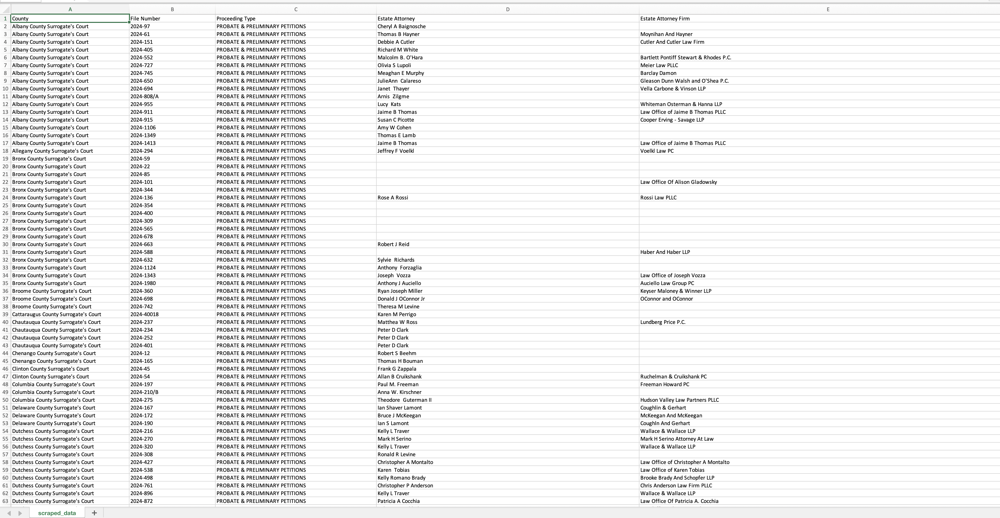

# New York State Court Web Surrogate Scraper

**Target Portal:** [New York Unified Court System - Attorney File Search](https://websurrogates.nycourts.gov/File/FileSearch)
A high-performance, resilient web automation tool built with **Python**, **Playwright**, and **BeautifulSoup4**. This scraper is engineered to navigate the New York State Unified Court System to extract detailed attorney and proceeding information from probate and administration records.

--- 

## 🚀 Overview:

The New York Court system employs complex filters and session-based navigation. This script automates the end-to-end workflow of:
1.  **Iterating** through all New York counties.
2.  **Filtering** by specific Proceeding Types (*Probate* & *Administration*).
3.  **Bypassing** result limits by automatically generating and searching through granular monthly date ranges.
4.  **Deep-scraping** individual file records to extract attorney names and law firm details.

--- 

## 🛠 Technical Features:

* **CDP (Chrome DevTools Protocol) Integration**: Designed to connect to an existing Chrome instance, allowing for better session persistence and reduced detection.
* **Advanced Cloudflare Evasion**: The target portal is protected by Cloudflare, which frequently uses invisible "Turnstile" challenges where the data-sitekey is not exposed in the HTML. To bypass this:
• The script connects to an already running Chrome instance via CDP.
• This allows the scraper to inherit a "clean" session that has already passed Cloudflare’s behavioral and JS-challenge checks.
• It avoids the need for external CAPTCHA solvers, which often fail when a site key is unavailable.
* **Intelligent Pagination**: Handles multi-page search results by tracking active states and managing browser history (`go_back`) to maintain state.
* **Robust Error Handling**: Implements a custom retry mechanism with configurable delays for navigating the often-unstable government portal.
* **Data Normalization**: Uses `BeautifulSoup4` with custom CSS selectors and string-matching logic to handle inconsistent HTML structures.
* **Automated CSV Persistence**: Features an append-mode saving system that handles header creation and ensures data is safe even if the script is interrupted.

---

## 📋 Prerequisites:
Before running the scraper, ensure you have the following installed:
* **Python 3.8+**
* **Playwright**
* **BeautifulSoup4** 
* **Python-Dateutil**


### 1. Installation
Install all dependencies using your requirements file:
```bash
pip install -r requirements.txt
```

---

## ⚙️ Setup & Execution

### 1. Launch Chrome in Debugging Mode
You **must** launch your browser with this command before starting the script. This creates the bridge the script needs to bypass Cloudflare.

**MacOS:**
```bash
/Applications/Google\ Chrome.app/Contents/MacOS/Google\ Chrome --remote-debugging-port=9222 --user-data-dir="~/chrome_profile"
```

## ⚙️ Configuration:
* The script uses environment variables and internal logic for orchestration:
* CDP URL: Set your CDP_URL (e.g., http://localhost:9222) in your environment.
* Target Year: Currently configured for 2024. To change the year, update the target_year variable in the run() method.
* Proceeding Types: Hardcoded to scrape PROBATE & PRELIMINARY PETITIONS and ADMINISTRATION PETITION.

---

## 📂 Data Output

* Scraped Data of Attorneys
This is the initial data extracted from the court portal. It includes the County, File Number, Proceeding Type, and the Attorney and Attorney Firm names.


