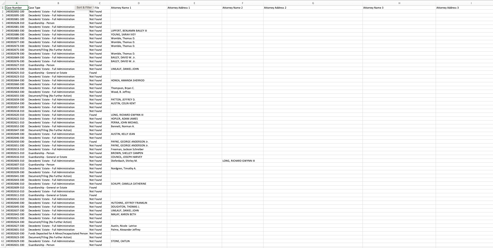
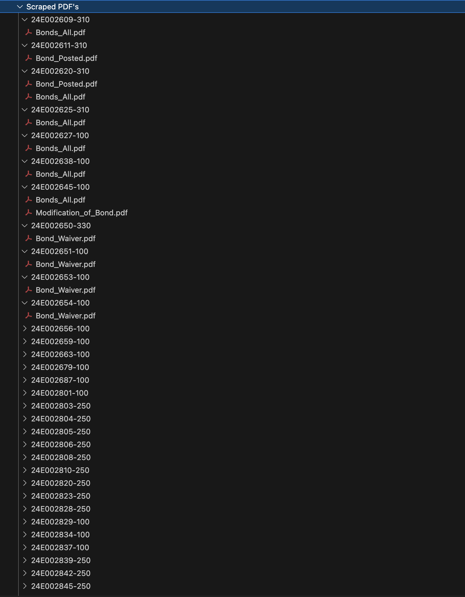

# North Carolina State Court Portal Scraper

A high-performance, resilient web automation tool built with **Python**, **Playwright**, and **BeautifulSoup4**. This scraper is engineered to navigate the [North Carolina Tyler Tech Portal](https://portal-nc.tylertech.cloud) to extract detailed attorney info, case summaries, and automated PDF downloads for Bond-related records.

---

## 🚀 Overview

The North Carolina court portal employs dynamic Kendo UI elements and reCAPTCHA V2 protection. This script automates a complex, non-linear workflow:

1.  **Initial Search & Bypass**: Fills the search form and solves the mandatory reCAPTCHA V2 using the 2Captcha API.
2.  **JS Function Injection**: Since Kendo UI dropdowns hide their underlying `<select>` elements, the script executes **custom JavaScript functions** in the browser context to force the page to display the maximum capacity (200 records).
3.  **API Reconstruction**: Extracts case IDs and unique identifiers from the HTML to dynamically construct REST API endpoints for every individual record.
4.  **Multi-Source Extraction**: Because attorney details and PDF metadata are stored in separate backend systems, the script queries multiple distinct APIs to compile a single, unified record.

## 🛠 Technical Features

* **CAPTCHA Automation**: Integrated with **2Captcha**. The script extracts the `data-sitekey` at runtime, fetches the token, and injects it directly into the hidden g-recaptcha field to unlock results.
* **Browser-Context JavaScript Execution**: Uses Playwright's ability to run **JavaScript functions** directly within the web page. This is used to manipulate the state of the Kendo UI pagination controls that are otherwise unclickable via standard automation.
* **Complex PDF URL Engineering**: Downloading PDFs is a multi-step challenge. The script extracts data in fragments (Document Type ID, Document Fragment ID, Location ID, etc.) from one API response to manually construct a valid, authenticated download URL for the document viewer API.
* **Resilient File Streaming**: Downloads PDFs in chunks to efficiently handle large files and prevent memory exhaustion during long-running sessions.
* **Dynamic CSV Architecture**: Implements a "look-ahead" logic that scans the entire dataset before saving. It identifies the maximum number of attorneys per case and dynamically generates unique columns (e.g., `Attorney Name 1`, `Attorney Address 1`, `Attorney Name 2`...) to meet strict client requirements for a flat-file format.
* **PDF File Status**: Logic-driven flag that marks `Found` if the Bond PDF was successfully retrieved and `Not Found` if no matching document exists for that case.

## 📋 Prerequisites

Before running the scraper, ensure you have the following installed:

* **Python 3.8 – 3.14+**
* **Playwright** 
* **BeautifulSoup4** 
* **2Captcha-Python** 
* **Requests** 

### 1. Installation
Install all dependencies using your requirements file:
```bash
pip install -r requirements.txt
```

## ⚙️ Configuration:
* The script uses environment variables and dynamic logic for orchestration:
* API KEY: Set your API_KEY for 2Captcha in your environment variables.
* Dynamic Record Logic: The script utilizes a generator to build record numbers. While currently targeting the 24E series, the year and sequence are handled via dynamic f-strings within the  
  while loop.
* Automated URL Building: All API endpoints for Parties, CaseEvents, and CaseSummariesSlim are constructed on-the-fly by extracting case_api_id and other tokens from the page content.

## 📁 Data Output & Directory Structure

The script is designed to provide a highly organized output. It validates PDF availability and flags them accordingly in the final report.

### 1. CSV Data Preview
The CSV includes a **PDF File Status** flag (`Found` / `Not Found`) and dynamically handles multiple attorneys.



### 2. Automated Directory Hierarchy
The script builds a nested directory structure to keep documents organized by case. It only constructs URLs and downloads files for documents identified as "Bonds."

**Structure:**
`Scraped Data` ➔ `Scraped PDF's` ➔ `[Case_Number]` ➔ `[Bond_File_1].pdf`, `[Bond_File_2].pdf`

